# ERD

```mermaid
erDiagram
    users {
        BIGINT id PK
        VARCHAR username UK
        VARCHAR password
        VARCHAR nickname UK
        VARCHAR email UK "nullable"
        VARCHAR role "USER, ADMIN"
        VARCHAR status "ACTIVE, WITHDRAWN, SUSPENDED"
        VARCHAR provider "LOCAL, GITHUB, GOOGLE"
        VARCHAR provider_id "nullable"
        INT reputation
        BOOLEAN is_expert
        BOOLEAN expert_requested
        DATETIME created_at
        DATETIME updated_at
    }

    tags {
        BIGINT id PK
        VARCHAR name UK
        DATETIME created_at
        DATETIME updated_at
    }

    questions {
        BIGINT id PK
        BIGINT author_id FK
        VARCHAR title
        TEXT content
        INT view_count
        INT like_count
        VARCHAR status "OPEN, RESOLVED, DELETED"
        BOOLEAN is_premium
        BOOLEAN is_anonymous
        VARCHAR type "GENERAL, CODE_REVIEW, CAREER_CONSULT"
        BOOLEAN type_locked
        TEXT summary "nullable, AI 요약 캐시"
        DATETIME deleted_at "nullable, soft delete"
        DATETIME created_at
        DATETIME updated_at
    }

    answers {
        BIGINT id PK
        BIGINT question_id FK
        BIGINT author_id FK
        TEXT content
        BOOLEAN is_adopted
        INT like_count
        BOOLEAN is_anonymous
        DATETIME deleted_at "nullable, soft delete"
        DATETIME created_at
        DATETIME updated_at
    }

    code_comments {
        BIGINT id PK
        BIGINT question_id FK
        BIGINT author_id FK
        INT line_number
        TEXT content
        DATETIME created_at
        DATETIME updated_at
    }

    question_tags {
        BIGINT id PK
        BIGINT question_id FK "UNIQUE(question_id, tag_id)"
        BIGINT tag_id FK
        INT sort_order
    }

    likes {
        BIGINT id PK
        BIGINT user_id FK "UNIQUE(user_id, target_type, target_id)"
        VARCHAR target_type "QUESTION, ANSWER"
        BIGINT target_id "다형 참조"
        DATETIME created_at
        DATETIME updated_at
    }

    reports {
        BIGINT id PK
        BIGINT reporter_id FK
        VARCHAR target_type "QUESTION, ANSWER"
        BIGINT target_id "다형 참조"
        BIGINT target_user_id "신고 대상 작성자, 연관관계 없음"
        TEXT reason
        VARCHAR status "PENDING, RESOLVED, REJECTED"
        DATETIME created_at
        DATETIME updated_at
    }

    attachments {
        BIGINT id PK
        VARCHAR target_type "QUESTION, ANSWER"
        BIGINT target_id "다형 참조"
        BIGINT uploader_id "연관관계 없음"
        VARCHAR original_filename
        VARCHAR stored_filename UK
        VARCHAR content_type
        BIGINT file_size
        DATETIME created_at
        DATETIME updated_at
    }

    chat_rooms {
        BIGINT id PK
        BIGINT question_id FK "CAREER_CONSULT 질문 대상"
        BIGINT answerer_id FK "답변자(채팅 개설자)"
        VARCHAR status "PENDING, ACTIVE, ADOPTED, CLOSED"
        DATETIME questioner_read_at "nullable"
        DATETIME answerer_read_at "nullable"
        DATETIME created_at
        DATETIME updated_at
    }

    chat_messages {
        BIGINT id PK
        BIGINT chat_room_id FK
        BIGINT sender_id FK
        TEXT content
        DATETIME created_at
        DATETIME updated_at
    }

    notifications {
        BIGINT id PK
        BIGINT recipient_id FK
        VARCHAR type "NEW_ANSWER, ANSWER_ADOPTED, NEW_CHAT_ROOM, CHAT_ACCEPTED, CHAT_ADOPTED"
        VARCHAR message
        VARCHAR link
        BOOLEAN is_read
        DATETIME created_at
        DATETIME updated_at
    }

    orders {
        BIGINT id PK
        BIGINT user_id FK
        VARCHAR plan_type "PREMIUM"
        BIGINT amount
        VARCHAR currency
        VARCHAR status "PENDING, PAID, CANCELLED"
        DATETIME created_at
        DATETIME updated_at
    }

    payments {
        BIGINT id PK
        BIGINT order_id FK
        VARCHAR payment_id UK "PortOne paymentId"
        VARCHAR status "READY, PAID, FAILED, CANCELLED"
        DATETIME paid_at "nullable"
        DATETIME cancelled_at "nullable"
        VARCHAR cancel_reason "nullable"
        DATETIME created_at
        DATETIME updated_at
    }

    subscriptions {
        BIGINT id PK
        BIGINT user_id FK "UNIQUE, 유저당 1개"
        VARCHAR plan_type "PREMIUM"
        DATETIME started_at
        DATETIME expires_at
        VARCHAR status "ACTIVE, EXPIRED, CANCELLED"
        VARCHAR billing_key "nullable, PortOne 빌링키"
        DATETIME created_at
        DATETIME updated_at
    }

    webhook_events {
        BIGINT id PK
        VARCHAR webhook_id UK "PortOne webhook-id"
        VARCHAR event_type
        VARCHAR payment_id "nullable"
        VARCHAR status "RECEIVED, PROCESSED, IGNORED"
        VARCHAR raw_payload "nullable"
        DATETIME created_at
        DATETIME updated_at
    }

    users ||--o{ questions : "author"
    users ||--o{ answers : "author"
    users ||--o{ code_comments : "author"
    users ||--o{ likes : "gives"
    users ||--o{ reports : "reporter"
    users ||--o{ chat_rooms : "answerer"
    users ||--o{ chat_messages : "sender"
    users ||--o{ notifications : "recipient"
    users ||--o{ orders : "places"
    users ||--o| subscriptions : "subscribes"

    questions ||--o{ answers : "receives"
    questions ||--o{ code_comments : "has"
    questions ||--o{ question_tags : "tagged"
    questions ||--o{ chat_rooms : "opens"
    tags ||--o{ question_tags : "used_in"

    chat_rooms ||--o{ chat_messages : "contains"
    orders ||--o{ payments : "attempts"

    questions ||..o{ likes : "target (QUESTION)"
    answers ||..o{ likes : "target (ANSWER)"
    questions ||..o{ reports : "target (QUESTION)"
    answers ||..o{ reports : "target (ANSWER)"
    questions ||..o{ attachments : "target (QUESTION)"
    answers ||..o{ attachments : "target (ANSWER)"
```

## Redis 저장 항목

| 항목                   | RedisHash            | TTL  | 용도                                                        |
| ---------------------- | -------------------- | ---- | ----------------------------------------------------------- |
| `refresh_token`        | `refreshToken`       | 적용 | Refresh Token 저장                                          |
| `oauth_signup_info`    | `oauthSignupInfo`    | 20분 | 소셜 신규가입 2단계 임시 정보 (provider, providerId, email) |
| `password_reset_token` | `passwordResetToken` | 30분 | 비밀번호 재설정 토큰 (token → userId)                       |
