### UF-01 - GUEST 사용자의 둘러보기

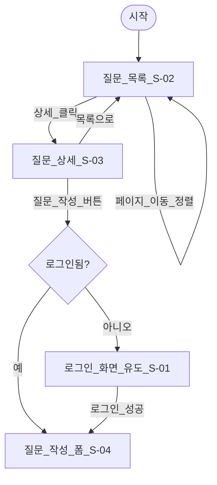

### UF-02 - 가입 후 질문, 답변, 채택

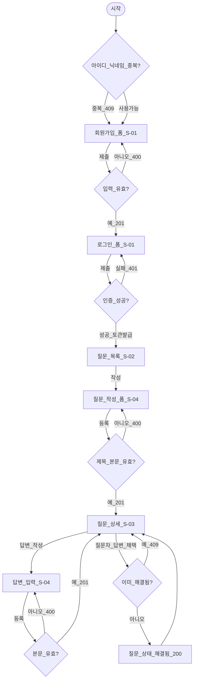

### UF-03 - 내 질문/답변 수정,삭제 (작성자 확인)

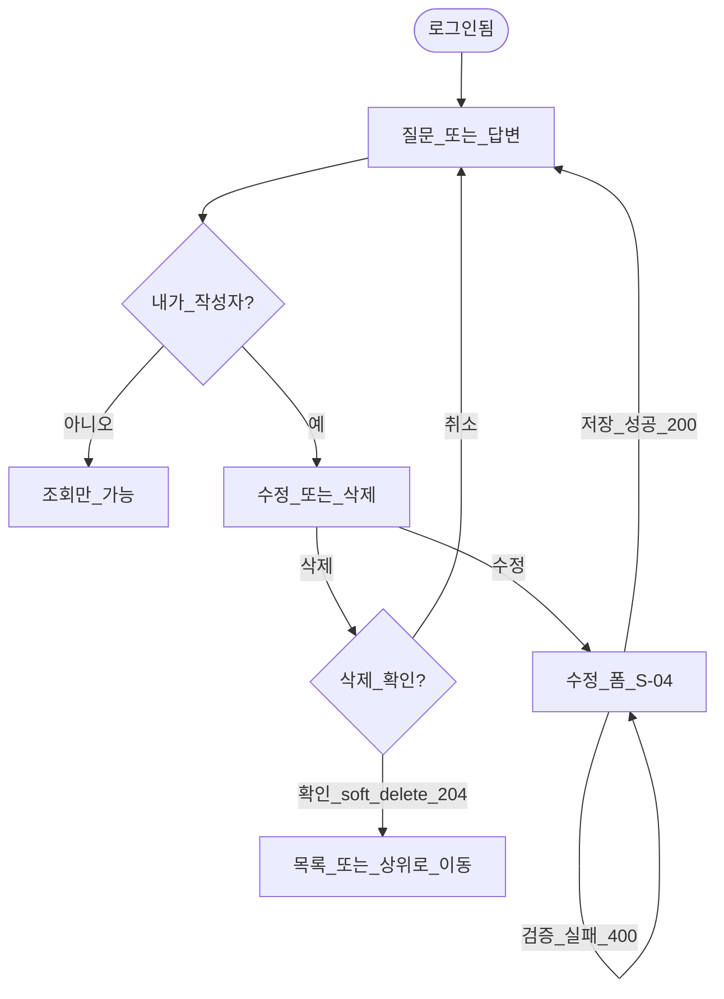

### UF-04 - 목록 → 상세 → 역할별 권한 분기

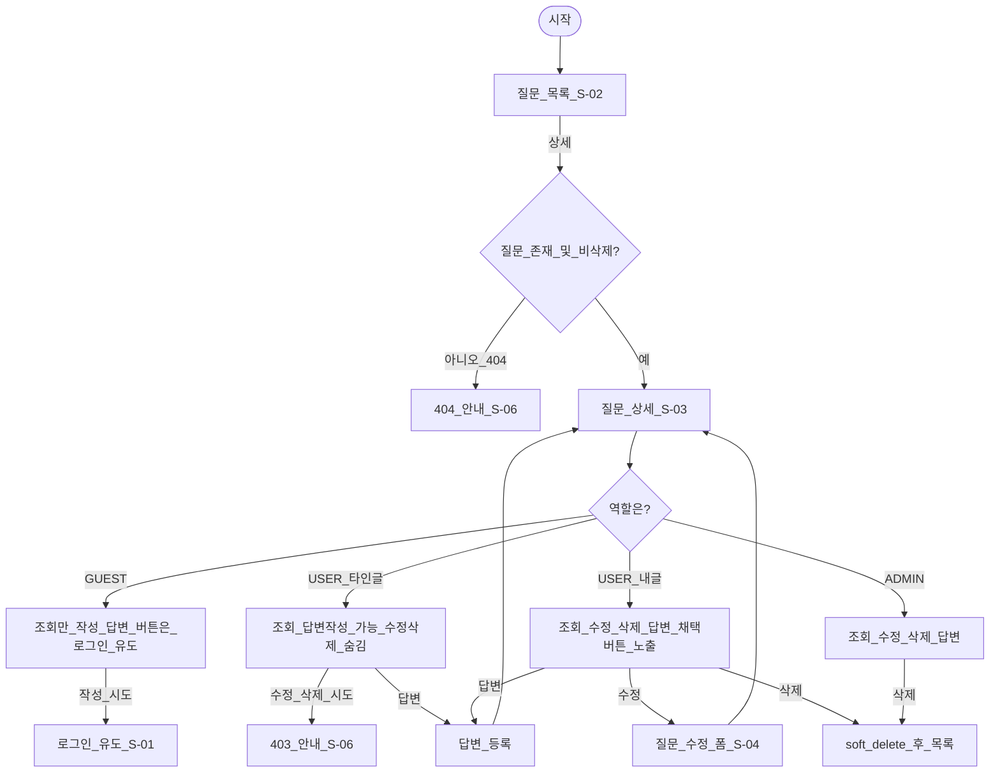

### UF-05 - 검색,태그,상태 필터 + 추천(좋아요)

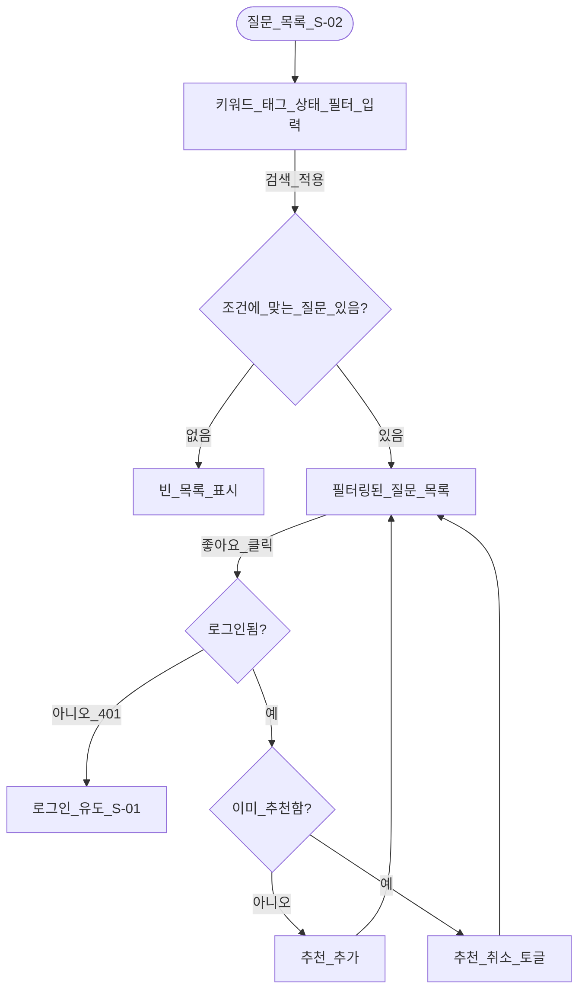

### UF-06 - 마이페이지 (정보수정, 비번변경, 탈퇴, 내 답변)

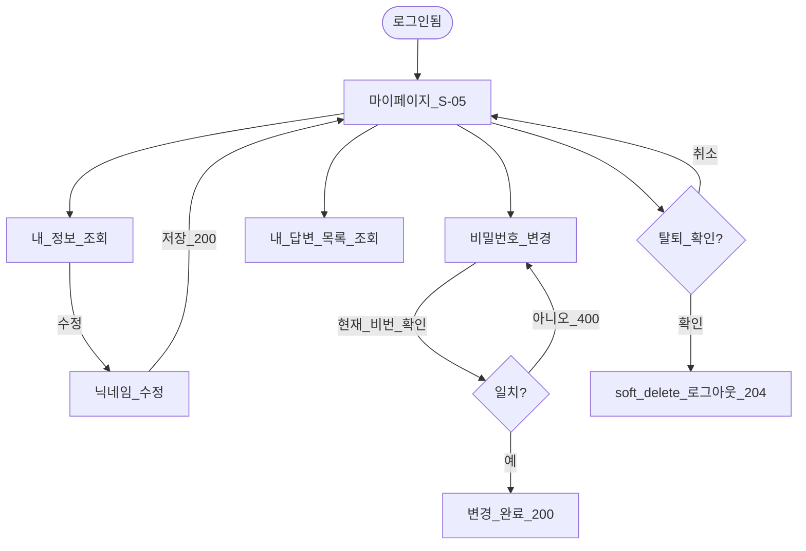

### UF-07 - **게시글/답변 신고 접수 및 관리자 처리**

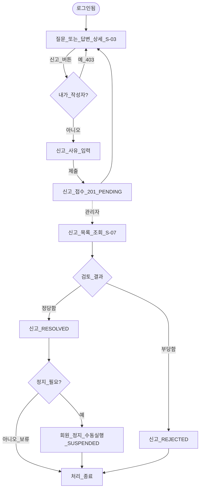

### UF-08 - 프리미엄 구독 결제 및 접근 제어

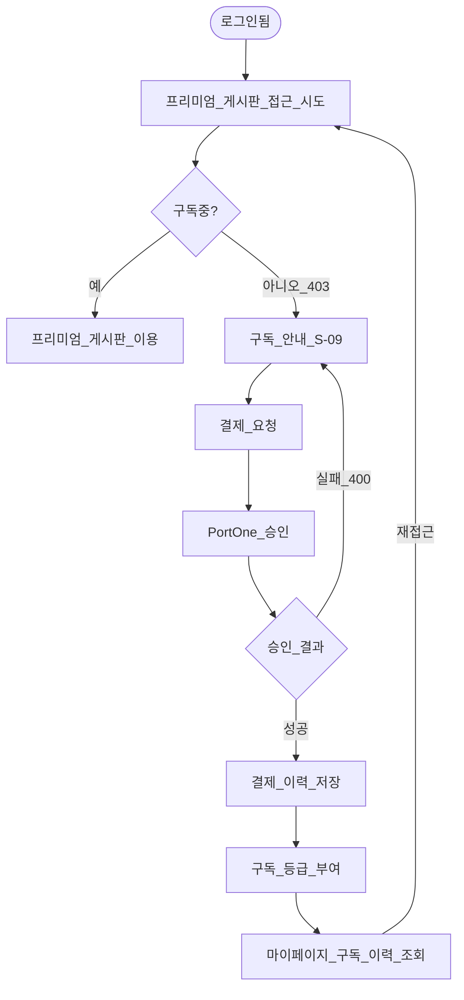

### UF-09 - GitHub/Google 소셜 로그인

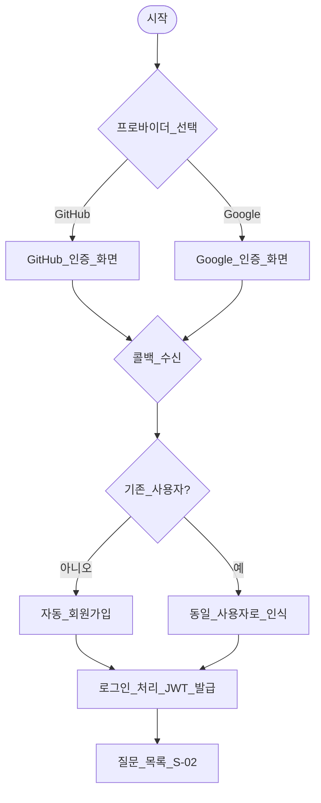

### UF-10 — 사용자 평판 시스템

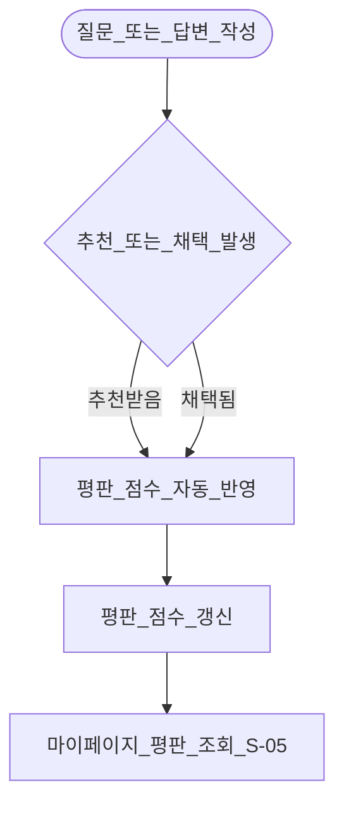

### UF-11 — 파일 첨부

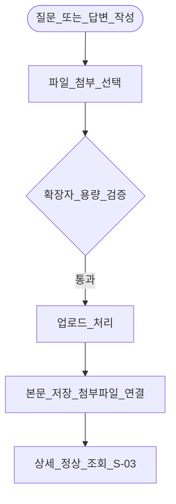

### UF-12 — 개인 활동 대시보드

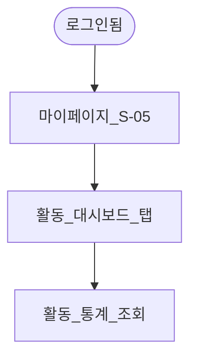

### UF-13 — 익명 질문 + 구독자 뱃지

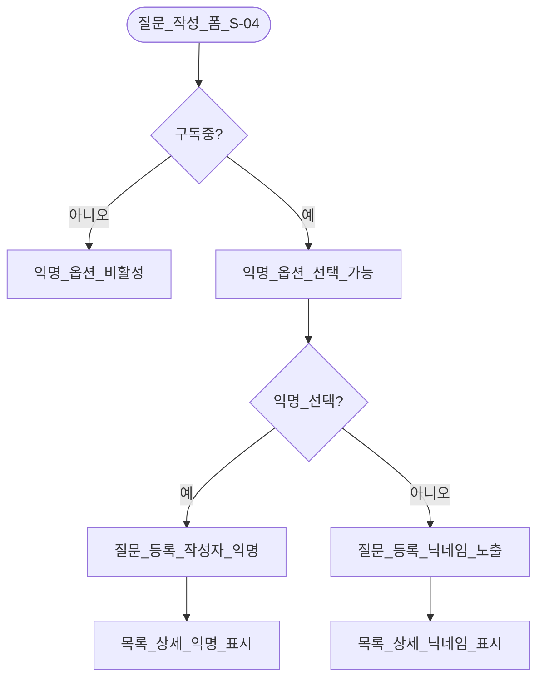

### **UF-X01, UF-X02, UF-X03, UF-X04, UF-X05 (예외·권한)**

```mermaid
flowchart TD
  subgraph auth_fail [미인증_쓰기_거부]
    Guest([GUEST_또는_토큰없음]) --> TryWrite[질문_답변_작성_또는_추천_시도]
    TryWrite --> E401[401_안내_S-06]
    E401 --> LoginHint[로그인_화면_유도_S-01]
  end

  subgraph forbid [본인_아닌_게시물_수정_삭제]
    User([USER]) --> Other[타인_질문_또는_답변]
    Other --> TryEdit[수정_또는_삭제_시도]
    TryEdit --> E403[403]
  end

  subgraph accept_fail [답변_채택_예외]
    Owner([질문_작성자_시도]) --> IsOwner{본인_질문?}
    IsOwner -->|아니오| E403b[403]
    IsOwner -->|예| StatusCheck{이미_해결됨?}
    StatusCheck -->|예| E409[409_중복채택]
    StatusCheck -->|아니오| Accepted[채택_완료]
  end

  subgraph report_fail [신고_예외]
    Reporter([로그인_사용자]) --> OwnPost{본인_게시물?}
    OwnPost -->|예| E403c[403_본인신고불가]
    OwnPost -->|아니오| ReportOk[신고_접수_가능]

    SuspendedUser([SUSPENDED_회원]) --> TryLogin[로그인_시도]
    TryLogin --> E401b[401_정지된_계정]
  end

  subgraph edge [기타_엣지]
    Anyone([누구든]) --> Missing[없는_질문_답변_ID]
    Missing --> E404[404]

    Logged([로그인_사용자]) --> Expired{Access_Token_유효?}
    Expired -->|만료| Reissue{Refresh_Token_유효?}
    Reissue -->|예| NewToken[Access_Token_재발급]
    Reissue -->|아니오_만료_위조| Relogin[재로그인_필요_401]
    NewToken --> OkPath[정상_API_재요청]
    Expired -->|유효| OkPath

    Logged --> BadInput[빈_제목_본문_제출]
    BadInput --> E400[400_검증_메시지]
  end
```

### **UF-X06, UF-X07 (예외·권한)**

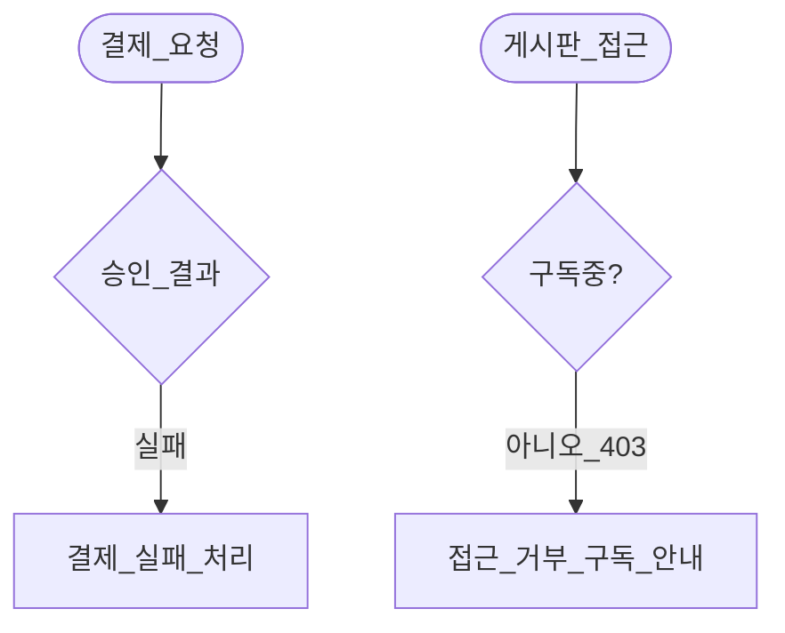

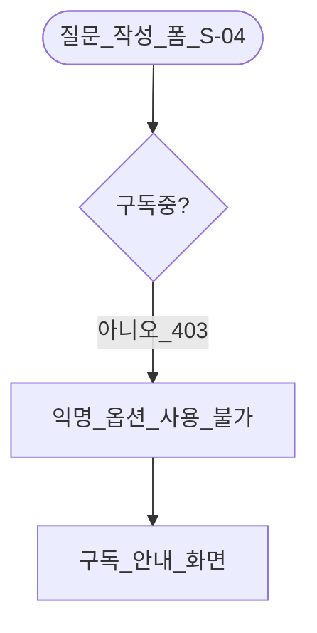

## 3. 화면 전환 요약

| 현재 화면             | 행동                    | 다음 화면           | 비고                       |
| --------------------- | ----------------------- | ------------------- | -------------------------- |
| 로그인 (S-01)         | 정지된 계정 로그인 시도 | 로그인 (S-01)       |                            |
| 질문\_목록 (S-02)     | 상세 클릭               | 질문\_상세 (S-03)   | 비로그인 OK                |
| 질문\_상세 (S-03)     | 작성 버튼 (GUEST)       | 로그인 (S-01)       | 유도                       |
| 질문\_목록 (S-02)     | 작성 (USER)             | 질문*작성*폼 (S-04) | 토큰 필요                  |
| 질문\_상세 (S-03)     | 타인 수정 시도          | 403 안내 (S-06)     | UF-X02                     |
| 질문\_상세 (S-03)     | 답변 채택 (질문자)      | 질문\_상세 (해결됨) | UF-X04                     |
| 질문\_목록 (S-02)     | 좋아요 클릭 (비로그인)  | 로그인 (S-01)       | UF-X01                     |
| 마이페이지 (S-05)     | 탈퇴 확인               | 로그아웃 상태       | soft delete                |
| 질문\_상세 (S-03)     | 신고 버튼 (본인 게시물) | 질문\_상세 (S-03)   | 403, UF-X05                |
| 질문\_상세 (S-03)     | 신고 버튼 (타인 게시물) | 신고*접수*완료      | 201 PENDING, UF-07         |
| 신고\_관리 (S-07)     | 신고 처리 (정당함)      | 회원\_관리 (S-08)   | 정지 필요 여부 판단, UF-07 |
| 회원\_관리 (S-08)     | 회원 정지 실행          | 회원\_관리 (S-08)   | SUSPENDED 전환             |
| 구독*안내*결제 (S-09) | 결제 요청 → 결제 승인   | 질문\_목록 (S-02)   | 구독 등급 부여             |
