# F-01 회원가입

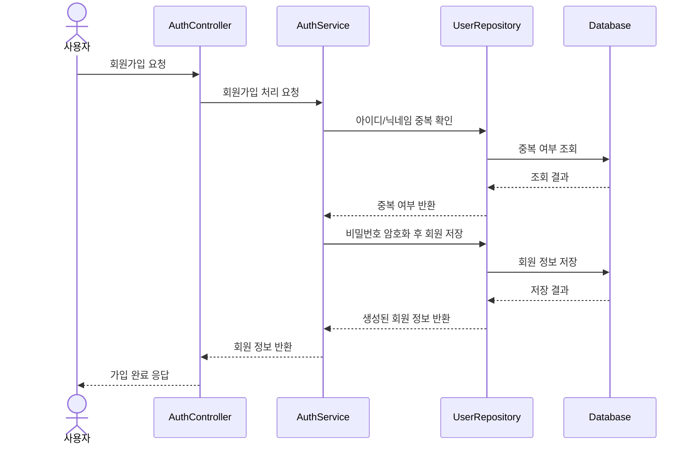

# F-02 로그인

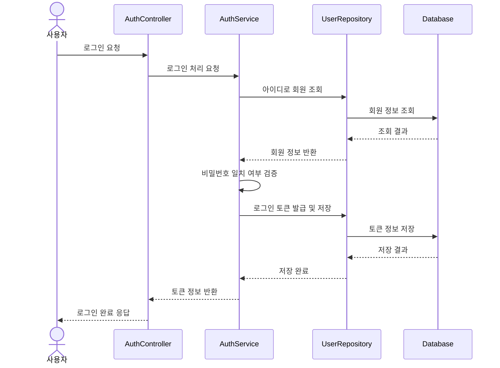

# F-06 질문 작성

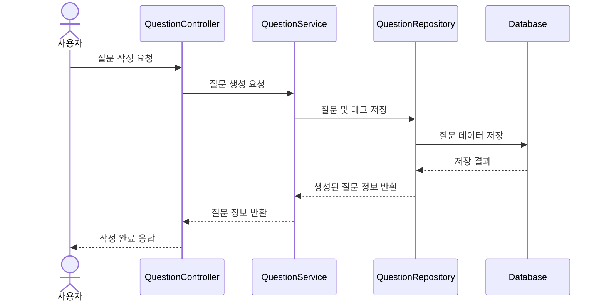

# F-12 답변 작성

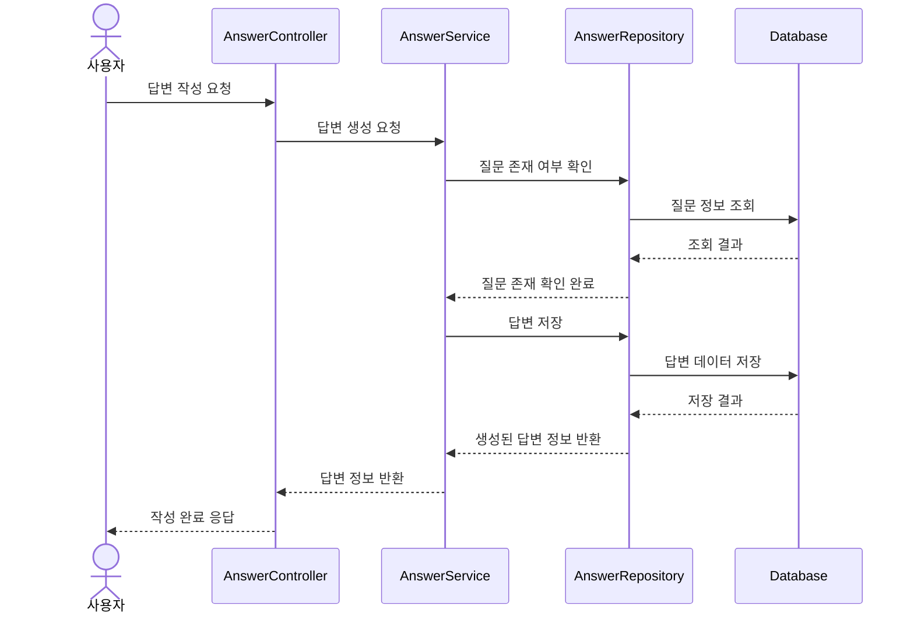

# F-14 답변 채택

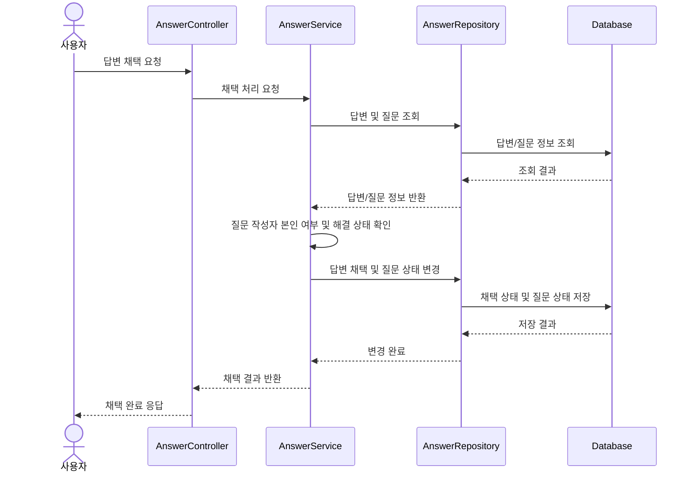

# F-16 질/답 추천

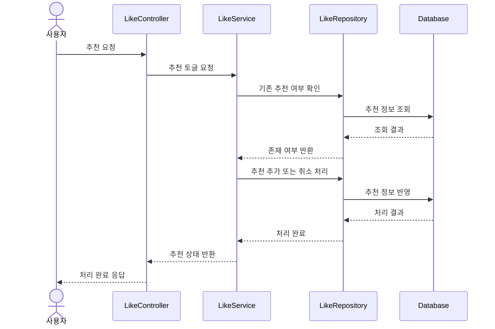

# F-26 게시글/답변 신고 접수

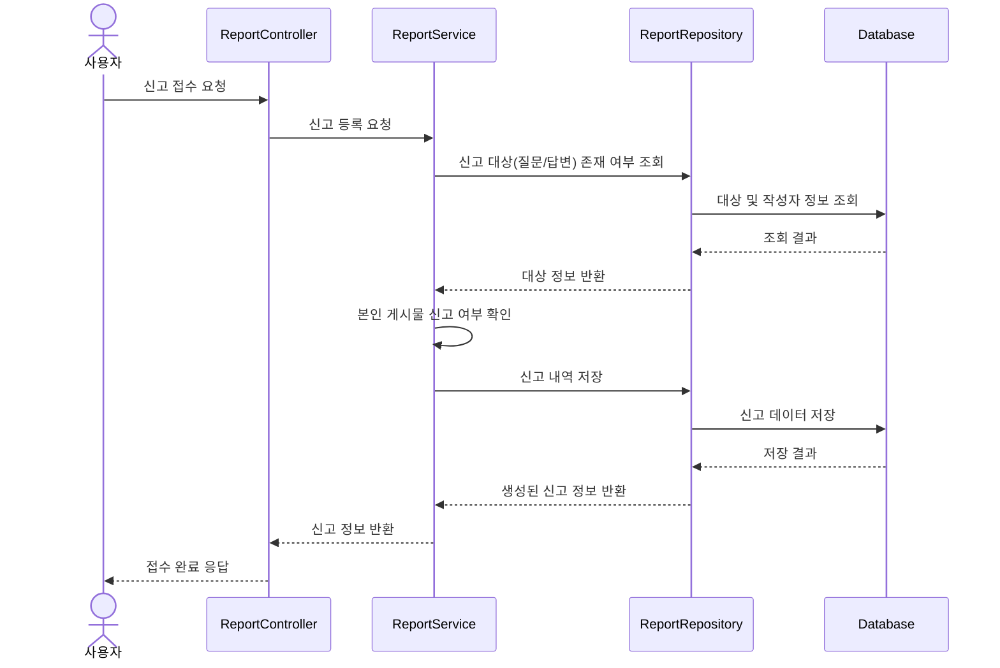

# F-27 신고 목록/처리

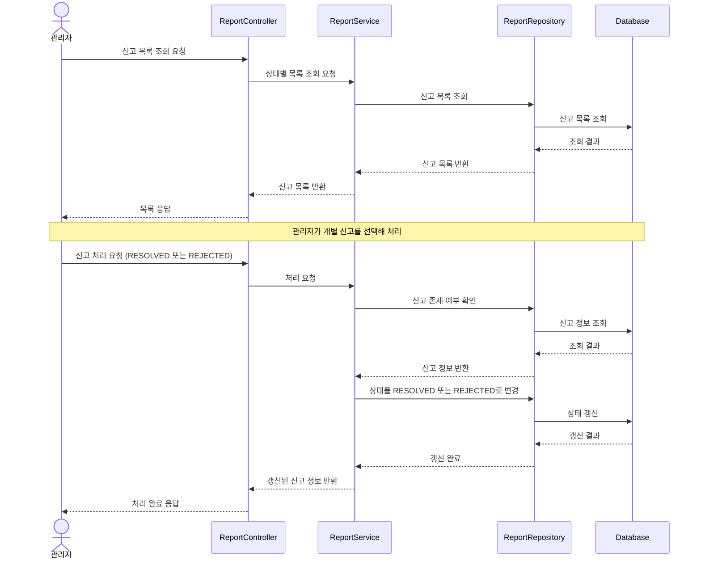

# F-30 PortOne V2 결제 연동

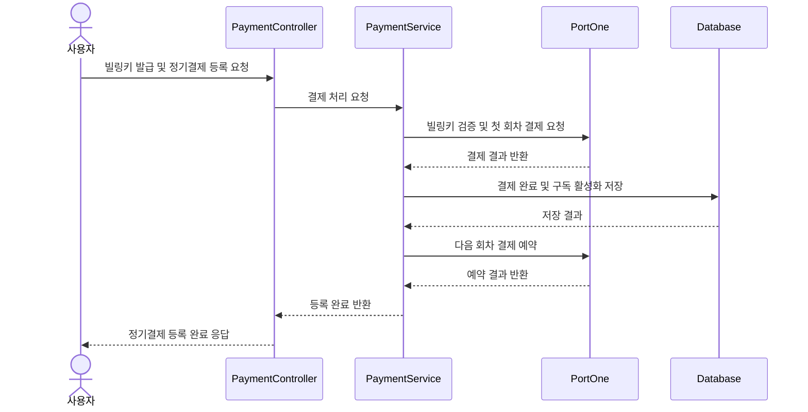

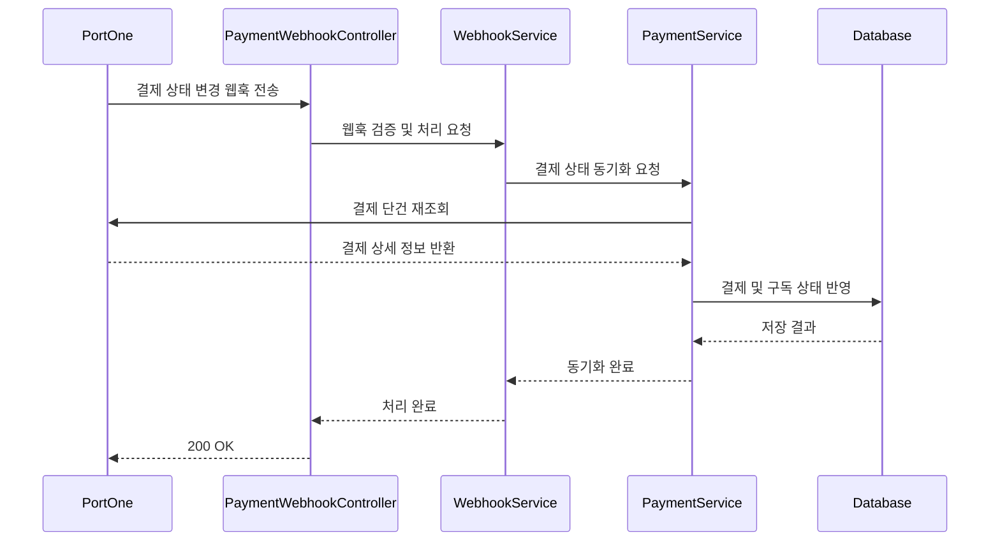

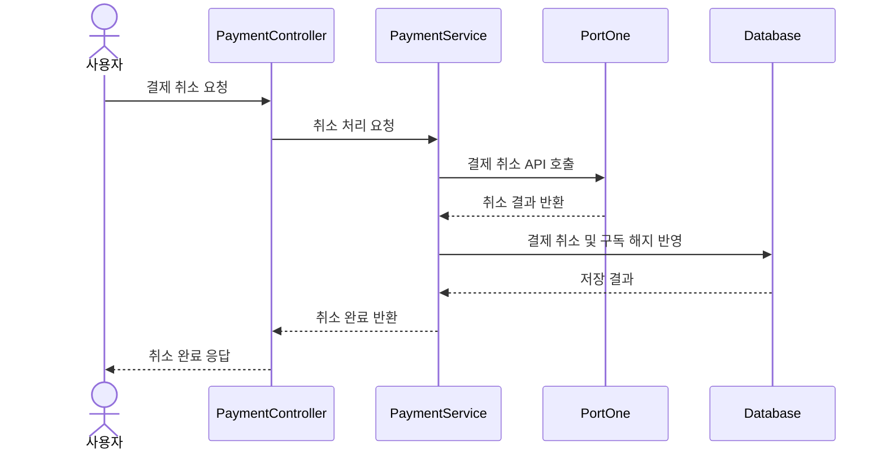

# F-33, F-34 GitHub 로그인/Google 로그인

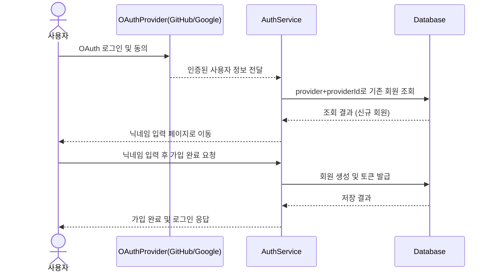

# F-35 사용자 평판 시스템

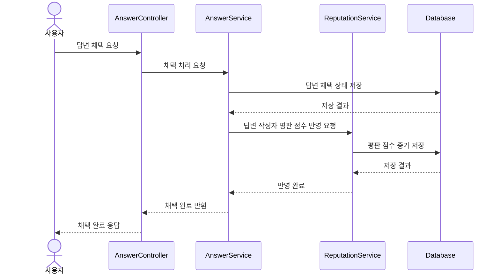
